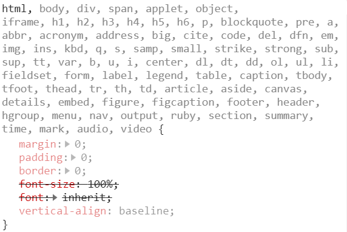

# Normalize CSS 와 CSS Reset에 대하여

## 20.02.06 (목)


---

### 참고자료

1) [Normalize CSS or CSS Reset?!](  https://medium.com/@elad/normalize-css-or-css-reset-9d75175c5d1e ) -  [Elad Shechter]( https://medium.com/@elad ) 님이 [Medium]( https://medium.com/ ) 에 올린 포스트

2) [Normalize.css Open Source by Nicolas Gallagher]( https://github.com/necolas/normalize.css ) - Normalize.css 오픈소스

3) [Reset.css Open Source by Eric Meyer]( https://meyerweb.com/eric/tools/css/reset/ ) - Reset.css 오픈소스

4) [HTML5, CSS 전체 초기화 CSS파일 공유합니다. default.css, reset.css, common.css]( https://www.youtube.com/watch?v=oWvyEil1j4M ) - '리베하얀' 님의 유튜브 콘텐츠

---


#### [0] 개요

* 브라우저에 관계없이 HTML element 들이 동일한 방식으로 보이기를 원함

* 모든 브라우저는 각 브라우저만의 기본 스타일을 적용 => 그래서 각 브라우저마다 특정 스타일이 존재 => 브라우저에 상관없이 일관성있게 표현하지 못 함

* User Agent 속성 간의 차이를 제거하는 데 어떤 방식을 사용해야 하는지에 대한 고민으로부터 출발

* ***CSS User Agent Styles*** 란?
  
  * 브라우저가 HTML 페이지를 랜더링할 때 적용하는 기본 스타일
  * ( 예 )  `<h1>` ~ `<h6>` 태그
  
  ```css
  /* user agent stylesheet */
  
  h1 {
      display: block;
      font-size: 2em;
      margin-block-start: 0.67em;
      margin-block-end: 0.67em;
      margin-inline-start: 0px;
      margin-inline-end: 0px;
      font-weight: bold;
  }
  ```
  
* 이러한 브라우저 불일치에서 나타나는 문제를 해결하려는 시도 중 가장 대표적인 두 가지가 ***Normalize CSS*** 와 ***CSS Reset***


#### [1] NormalizeCSS

* Normalize.css 는 HTML 요소의 기본 스타일에서 브라우저 간 일관성을 제공하는 작은 css  파일

* 즉, 브라우저에서 적용한 스타일의 W3C 표준을 보고 브라우저 중 하나에 불일치가 있으면 normalize.css 스타일이 차이가 있는 브라우저 스타일을 수정함

* 그러나, 경우에 따라 일반적으로 IE 또는 EDGE로 인해 결함이 있는 브라우저를 표준에 따라 수정할 수 없음 => 이 경우 Normalize의 수정 사항은 IE 또는 EDGE 스타일을 나머지 브라우저에 적용함

* ( 예 )

  * Chrome, Safari 및 Firefox 브라우저

  ```css
  /* 
    <article> / <aside> / <nav> / <section> 태그 안에있는 <h1> 태그를 독립 <h1>보다 작은 글꼴 크기로 렌더링. 태그 및 여백 크기가 다름
  */
  
  :-webkit-any(article,aside,nav,section) h1 {
     font-size: 1.5em;
     margin-block-start: 0.83em;
     margin-block-end: 0.83em;
  }
  ```

  * Internet Explorer 및 EDGE 브라우저

  ```css
  /*
  <h1> 스타일을 재설정하여 모든 브라우저에서 동일하게 작동하도록하기 위해 Normalize.css는 모든 브라우저에서 적용할 IE / EDGE 스타일을 정의
  */
  
  /* 
    Correct the font size and margin on `h1` elements within `section`  and `article` contexts in Chrome, Firefox, and Safari.
  
  => Chrome, Firefox 및 Safari의`section` 및`article` 컨텍스트 내`h1` 요소의 글꼴 크기와 여백을 수정하십시오.
  */
  
   h1 {  font-size: 2em;  margin: 0.67em 0;}
  ```


#### [2] CSS Reset

* CSS Reset은 ***브라우저의 기본 스타일이 전혀 필요하지 않다***  는 다른 접근 방식을 취함

* 필요한 스타일이 무엇이든 필요에 따라 프로젝트에서 정의함

* 따라서, ***CSS Reset*** 은 브라우저의 User Agent 속성과 함께 제공되는 모든 스타일을 재설정함

* CSS Reset 방식에서는 모든 HTML 태그에 no padding, no margin, no border, 동일한 글꼴 크기 및 동일한 정렬이 있도록 정의

* ( 예 ) 

  * [Eric Meyer's CSS Reset]( https://meyerweb.com/eric/tools/css/reset/ ) 의 일부

  ```css
  html, body, div, span, applet, object, iframe, h1, h2, h3, h4, h5, h6, p, blockquote, pre, a, abbr, acronym, address, big, cite, code, del, dfn, em, img, ins, kbd, q, s, samp, small, strike, strong, sub, sup, tt, var, b, u, i, center, dl, dt, dd, ol, ul, li, fieldset, form, label, legend, table, caption, tbody, tfoot, thead, tr, th, td, article, aside, canvas, details, embed,  figure, figcaption, footer, header, hgroup,  menu, nav, output, ruby, section, summary, time, mark, audio, video {  
     margin: 0;  
     padding: 0;  
     border: 0;  
     font-size: 100%;  
     font: inherit;  
     vertical-align: baseline; 
  }
  ```

  * [유튜버 '리베하얀'](  https://www.youtube.com/channel/UCq7-gOh15ChDcFJ9xN9SYmg  ) 님께서 공유해주신 reset.css

  ```css
  @charset "utf-8";
  
  /* WebFont - 웹전용, 기본 폰트 import */
  @import url(http://fonts.googleapis.com/earlyaccess/notosanskr.css);
  
  /* Reset */
  
  /* mobile전용 - touch시 외곽라인 없에기, voice over나 talk back 사용시 outline이 생기기 때문에 default로 outline을 제거*/
  * {outline:0 !important;}
  
  
  html,body,h1,h2,h3,h4,h5,h6,div,p,blockquote,pre,code,address,ul,ol,li,menu,nav,section,article,aside,
  dl,dt,dd,table,thead,tbody,tfoot,label,caption,th,td,form,fieldset,legend,hr,input,button,textarea,object,figure,figcaption {margin:0;padding:0;}
  html, body{width:100%;}
  
  /* webkit = iOS,Android / 크롬기반 브라우저, 애플기반 브라우저 전용  */
  /* touch-callout - 꾹 눌렀을때 메뉴기능 */
  /* user-select - 드래그 */
  /* tap-highligh-color - 링크 highlight */
  html{-webkit-touch-callout:none; -webkit-user-select:none; -webkit-tap-highlight-color:rgba(0, 0, 0, 0);}
  
  /* min-width - old 폰 가로 사이즈 대처 */
  /* text-size-adjust - 아이폰 뷰포트 변경 제어 */
  /* word-wrap, break-word, word-break, break-all - 긴문장 자르기 */
  body{width:100%; background:#fff; min-width:320px; -webkit-text-size-adjust:none;word-wrap:break-word;word-break:break-all;}
  
  /* 본문 기본 폰트 설정 (여기서는 webfont) */
  body,input,select,textarea,button {border:none;font-size:12px; font-family:'Noto Sans KR', sans-serif;color:#727272;}
  ul,ol,li{list-style:none;}
  
  /* border-collapse:collapse - 테이블 선과 선이 만나는 굵기 기본 1px */
  /* border-spacing:0 - 셀 여백 0 */
  table{width:100%;border-spacing:0;border-collapse:collapse;}
  img,fieldset{border:0;}
  
  /* font-style: normal - 이탤릭체를 기본 서체로 */
  address,cite,code,em{font-style:normal;font-weight:normal;}
  label,img,input,select,textarea,button{vertical-align:middle;}
  .hide,caption,legend{line-height:0;font-size:1px;overflow:hidden;}
  hr{display:none;}
  
  /* 새로운 요소들이 모두 inline 요소라서 block으로 재설정 */
  main,header,section,nav,footer,aside,article,figure{display:block;}
  
  /* 링크 색상, 밑줄 제거 */
  a{color:#000;text-decoration:none;}
  a:focus,
  a:hober {text-decoration: none;}
  
  /* Form */
  textarea { border:1px solid #dbdbdb;}
  select { height:32px; font-size:13px; color:#373737; border:1px solid #e9e9e9; background:#fff;border-radius: 5px;}
  input[type=tel],
  input[type=time],
  input[type=text],
  input[type=password],
  input[type=search],
  input[type=email],
  input[type=file],
  input[type=url],
  input[type=number],
  input[type=date],textarea {width:100%; height:30px; font-size:13px; color:#373737; border:1px solid #e9e9e9; background:#fff; text-indent:20px; border-radius: 5px; transition: all 0.5s; vertical-align:middle;}
  
  /* placeholder 디자인을 위한 부분 */
  input::-webkit-input-placeholder{color:#b5b5b5; font-size:12px; line-height:100%;}
  textarea { padding:5px 0;}
  select:focus,
  textarea:focus,
  input:focus { border: 1px solid #727272;}
  
  /* form 요소의 초기화 모양을 일치*/
  input[type=tel][readonly],
  input[type=text][readonly],
  input[type=password][readonly],
  input[type=email][readonly], 
  input[type=search][readonly], 
  input[type=tel][disabled],
  input[type=text][disabled],
  input[type=password][disabled],
  input[type=search][disabled],
  input[type=email][disabled]{background:#eaeaea; border-color:#c0c0c0; color:#666; -webkit-appearance:none;font-size:12px;}
  textarea[readonly],
  textarea[disabled]{padding:11px; font-size:16px; color:#666; font-weight:normal; line-height:140%; height:78px; background:#eaeaea;border:1px solid #c0c0c0;}
  
  .clear {clear:both;}
  .clear:after { content:""; display:block; clear:both;}
  ```

  

* 그러나, CSS Reset의 문제점은 ***UGLY(추악하다)***

  * big chain of selectors
  * a lot of unnecessary overrides
  * unreadable when debugging
  * (예) CSS Reset - chain of ugly CSS selectors

  