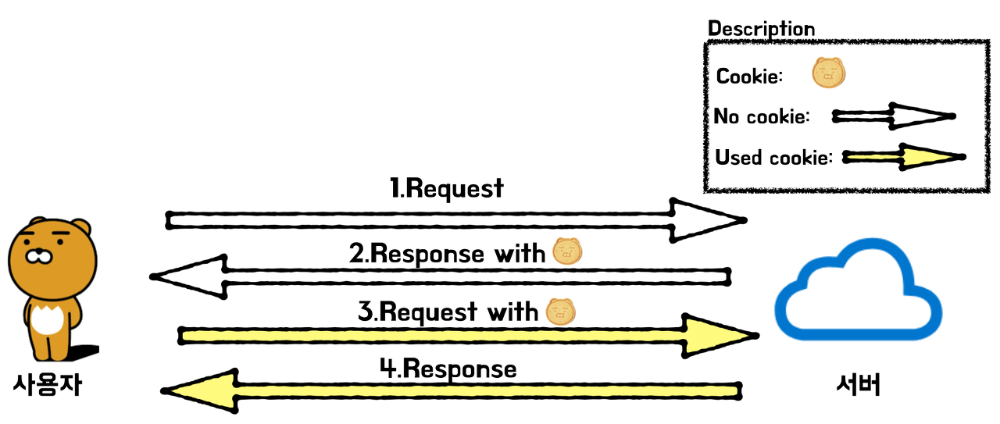

# 쿠키와 세션에 대하여

## 20.03.05(목)

---

### 참고자료

1) [쿠키와 세션 개념]( https://interconnection.tistory.com/74 )

---

#### [0] HTTP 프로토콜

> 쿠키와 세션에 대해 알아보기 전 HTTP 특징에 대해 알아보자

##### 1} HTTP의 특징

* HTTP 프로토콜 환경에서 서버는 클라이언트가 누구인지 확인해야 함
* 그 이유는 HTTP 프로토콜이 **`connectionless`**, **`stateless`** 한 특성이 있기 때문!
  * **connectionless**
    * 클라이언트가 요청을 한 후 응답을 받으면 그 연결을 끊어 버리는 특징
    * HTTP는 먼저 클라이언트가 request를 서버에 보내면, 서버는 클라이언트에게 요청에 맞는 response를 보내고 접속을 끊는 특성이 있음
    * 헤더에 **`keep-alive`** 라는 값을 줘서 커넥션을 재활용하는데 HTTP1.1에서는 이것이 디폴트
    * HTTP가 tcp위에서 구현됨 (tcp는 연결지향, udp는 비연결지향)
    * 그렇기 때문에 네트워크 관점에서 keep-alive는 옵션으로 connectionless의 연결비용을 줄이는 것을 장점으로 비연결지향이라 함
  * **stateless**
    * 통신이 끝나면 상태를 유지하지 않는 특징
    * 연결을 끊는 순간, 클라이언트와 서버의 통신이 끝나며 상태 정보는 유지하지 않는 특성이 있음
* 이러한 HTTP 프로토콜의 특징이자 약점을 보완하기 위해 ***쿠키*** 와 ***세션*** 을 사용한다!
  * 만약 ***쿠키*** 와 ***세션*** 을 사용하지 않으면?
    * 쇼핑몰에서 옷을 구매하려고 로그인을 했음에도, 페이지를 이동할 때마다 계속 로그인을 해야함
  * ***쿠키*** 와 ***세션*** 을 활용했기 때문에 한 번 로그인을 하면 ***`어떠한 방식`*** 에 의해서 그 사용자에 대한 인증을 유지하게 됨
* 자 이제 그 ***어떠한 방식*** 에 대해 본격적으로 알아보자

#### [1] 쿠키(Cookie)

##### 1} 정의

* ***클라이언트(브라우저) 로컬에 저장*** 되는 키와 값이 들어있는 작은 데이터 파일

##### 2} 구성요소

* 이름 - 각각의 쿠키를 구별하는데 사용되는 이름
* 값 - 쿠키의 이름과 관련된 값
* 유효시간 - 쿠키의 유지시간
* 도메인 - 쿠키를 전송할 도메인
* 경로 - 쿠키를 전송할 요청 경로

##### 3} 동작 방식

그림 1) 쿠키를 발급받고 사용하는 과정

**( 출처 :  서버 개발자 안이민님의 ['라이언 서버' 블로그]( https://interconnection.tistory.com/ ) > '[쿠키와 세션 개념]( https://interconnection.tistory.com/74 )' )**

1. 클라이언트가 페이지를 요청
2. 서버에서 쿠키를 생성
3. HTTP 헤더에 쿠키를 포함시켜 응답
4. 브라우저가 종료되어도 쿠키 만료 기간이 있다면 클라이언트에서 보관하고 있음
5. 같은 요청을 할 경우 HTTP 헤더에 쿠키를 함께 보냄
6. 서버에서 쿠키를 읽어 이전 상태 정보를 변경할 필요가 있을 때 쿠키를 업데이트하여 변경된 쿠키를 HTTP 헤더에 포함시켜 응답

##### 4} 특징

* 사용자 인증이 유효한 시간을 명시할 수 있으며, 유효 시간이 정해지면 브라우저가 종료되어도 인증이 유지된다는 특징이 있음
* 쿠키는 클라이언트의 상태 정보를 로컬에 저장했다가 참조함
* 클라이언트에 300개까지 쿠키저장 가능, 하나의 도메인당 20개의 값만 가질 수 있음, 하나의 쿠키값은 4KB까지 저장함
* Response Header에 Set-Cookie 속성을 사용하면 클라이언트에 쿠키를 만들 수 있음
* 쿠키는 사용자가 따로 요청하지 않아도 브라우저가 Request시에 Request Header를 넣어서 자동으로 서버에 전송함

##### 5} 사용예시

* 방문 사이트에서 로그인시, "아이디와 비밀번호를 저장하시겠습니까?"
* 쇼핑몰의 장바구니 기능
* 자동로그인
* 팝업에서 "오늘 더 이상 이 창을 보지 않음" 체크

#### [2] 세션(Session)

##### 1} 설명

* 세션은 쿠키를 기반하고 있지만, ***사용자 정보 파일을 브라우저에 저장하는 쿠키*** 와 달리 ***세션은 서버 측에서 관리함***
* 서버에서는 클라이언트를 구분하기 위해 세션 ID를 부여하여 웹 브라우저가 서버에 접속해서 브라우저를 종료할 때까지 인증상태를 유지함
* 물론 접속 시간에 제한을 두어 일정 시간 응답이 없다면 정보가 유지되지 않게 설정 가능
* 사용자에 대한 정보를 서버에 두기 때문에 쿠키보다 보안에 좋으나, 사용자가 많아질수록 서버 메모리를 많이 차지하게 됨
* 즉, 동시접속자 수가 많은 웹 사이트인 경우에는 서버에 과부하를 주게 되므로 성능 저하의 요인이 됨
* 클라이언트가 Request를 보내면, 해당 서버의 엔진이 클라이언트에게 유일한 ID를 부여하는데 이것이 세션 ID

##### 2} 동작방식

1. 클라이언트가 서버에 접속시 세션 ID를 발급받음
2. 클라이언트는 세션 ID에 대해 쿠키를 사용해서 저장하고 가지고 있음
3. 클라이언트는 서버에 요청할 때, 이 쿠키의 세션 ID를 서버에 전달해서 사용함
4. 서버는 세션 ID를 전달받아서 별다른 작업없이 세션 ID로 세션에 있는 클라이언트 정보를 가져옴
5. 클라이언트 정보를 가지고 서버 요청을 처리하여 클라이언트에게 응답함

##### 3} 특징

* 각 클라이언트에게 고유 ID를 부여
* 세션 ID로 클라이언트를 구분해서 클라이언트의 요구에 맞는 서비스를 제공
* 보안 측면에서 쿠키보다 우수
* 사용자가 많아질수록 서버 메모리를 많이 차지하게 됨

##### 4} 사용예시

* ***로그인*** 처럼 보안상 중요한 작업을 수행할 때 사용

#### [3] 쿠키와 세션의 차이점

1. 쿠키와 세션은 비슷한 역할을 하며, 동작원리도 비슷하다, 그 이유는 ***세션도 결국 쿠키를 사용하기 때문***
2. 가장 큰 차이점은 ***사용자의 정보가 저장되는 위치***
   1. 쿠키는 서버의 자원을 전혀 사용하지 않음
   2. 세션은 서버의 자원을 사용함
3. 요청 속도 - 쿠키가 세션보다 더 빠름(그 이유는 세션은 서버의 처리가 필요하기 때문)
4. 보안
   1. 쿠키 - 클라이언트 로컬에 저장되기 때문에 변질되거나 request에서 스니핑 당할 우려가 있어서 보안에 취약
   2. 세션 - 쿠키를 이용해서 sessionid만 저장하고 그것으로 구분해서 서버에서 처리하기 때문에 비교적 보안성이 좋음
5. ***라이프 사이클***
   1. 쿠키 - 만료시간이 있으나 파일로 저장되기 때문에 ***브라우저를 종료해도 계속해서 정보가 남아있을 수 있음***, 또한, 만료기간을 넉넉하게 잡아두면 쿠키삭제를 할 때까지 유지될 수도 있음
   2. 세션 - 만료시간을 정할 수 있으나, ***브라우저가 종료되면***  만료시간에 상관없이 ***삭제***된다
6. 속도
   1. 쿠키 - 정보가 쿠키에 있기 때문에 서버에 요청시 속도가 빠름
   2. 세션 - 정보가 서버에 있기 때문에 처리가 요구되어 비교적 속도가 느림

#### [4] 쿠키/세션은 캐시와 엄연히 다르다!

1. 캐시 - 이미지 혹은 css, js 파일 등을 브라우저나 서버 앞 단에 저장해놓고 사용하는 것
2. 한 번 캐시에 저장되면, 브라우저를 참고하기 때문에 서버에서 변경이 되어도 사용자는 변경되지 않게 보일 수 있는데 이런 부분을 캐시를 지워주거나 서버에서 클라이언트로 응답을 보낼 때 header에 캐시 만료시간을 명시하는 방법 등을 이용할 수 있음
3. 보통 쿠키와 세션의 차이를 물어볼 때 저장위치와 보안에 대해서는 잘 답변하는데 사실 중요한 것은 라이프사이클을 얘기하는 것!

#### [5] 세션을 사용하면 좋은데 왜 쿠키를 사용할까?

* ***세션은 서버의 자원을 사용하기 때문에***  무분별하게 만들다보면 서버의 ***메모리를 감당할 수 없어질 수가 있고 속도가 느려질 수 있기 때문***

#### [6] 세션의 약점을 보완하기 위한 추세

* 세션은 사용자의 수만큼 서버 메모리를 차지하기 때문에 최근에는 이런 문제들을 보완한 토큰 기반의 인증방식을 사용하는 추세
* [고마워서 만든 블로그 by 맛소금 > 토큰 기반 인증 간단 정리 Token based Authentication](https://blog.msalt.net/251)

#### [7] 정리

1. 쿠키와 세션을 알기에 앞서 HTTP 프로토콜의 특징(connectionless, stateless)에 대해 알 필요가 있다
   1. 요청 뒤 응답을 받으면 연결을 끊으니까
   2. 연결을 끊는 순간, 서버의 통신이 끝나며 상태 정보는 유지하지 않음
2. 저장위치
   1. ***쿠키는 클라이언트(브라우저) 로컬에 저장***
   2. ***세션은 서버에서 관리***
3. 보안
   1. 쿠키는 로컬에 저장되어 변질되거나 request에서 스니핑 당할 우려가 있어 취약
   2. 세션은 쿠키에서 sessionid만 저장하여 그것으로 구분해서 서버에서 처리하기 때문에 비교적 보안성이 좋음
4. 쿠키와 세션의 차이점에서 저장위치, 보안도 중요하지만 ***라이프 사이클*** 도 중요하다는 점!
   1. 쿠키는 브라우저를 종료해도 로컬에 저장되어 정보가 남아있을 수 있음
   2. 세션은 브라우저가 종료되면 삭제됨